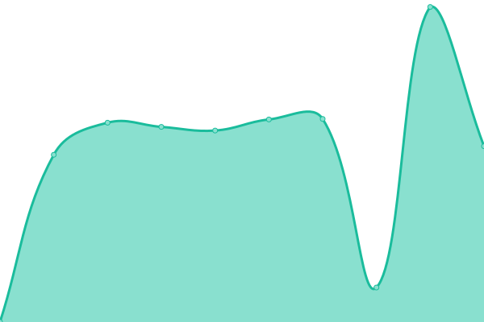

## 📈 Live Status: <!--live status--> **🟩 All systems operational**

<!--start: status pages-->
<!-- This summary is generated by Upptime (https://github.com/upptime/upptime) -->
<!-- Do not edit this manually, your changes will be overwritten -->
<!-- prettier-ignore -->
| URL | Status | History | Response Time | Uptime |
| --- | ------ | ------- | ------------- | ------ |
|  [Documentation](https://documentation.platformos.com) | 🟩 Up | [documentation.yml](https://github.com/Platform-OS/instances-uptimez/commits/HEAD/history/documentation.yml) | 

 1016ms
     
 | 

<a href="https://pavelloz.github.io/instances-uptimez/history/documentation">100.00%</a>
    

|  [Marketing page](https://www.platformos.com) | 🟩 Up | [marketing-page.yml](https://github.com/Platform-OS/instances-uptimez/commits/HEAD/history/marketing-page.yml) | 

 975ms
     
 | 

<a href="https://pavelloz.github.io/instances-uptimez/history/marketing-page">100.00%</a>
    

|  [Examples](https://examples.platform-os.com) | 🟩 Up | [examples.yml](https://github.com/Platform-OS/instances-uptimez/commits/HEAD/history/examples.yml) | 

 514ms
     
 | 

<a href="https://pavelloz.github.io/instances-uptimez/history/examples">100.00%</a>
    

|  [Template MVP](https://getmarketplace.co) | 🟩 Up | [template-mvp.yml](https://github.com/Platform-OS/instances-uptimez/commits/HEAD/history/template-mvp.yml) | 

 1127ms
     
 | 

<a href="https://pavelloz.github.io/instances-uptimez/history/template-mvp">100.00%</a>
    

|  [Community Site](https://community.platformos.com) | 🟩 Up | [community-site.yml](https://github.com/Platform-OS/instances-uptimez/commits/HEAD/history/community-site.yml) | 

 3542ms
     
 | 

<a href="https://pavelloz.github.io/instances-uptimez/history/community-site">100.00%</a>
    

|  [Partner Portal](https://partners.platformos.com) | 🟩 Up | [partner-portal.yml](https://github.com/Platform-OS/instances-uptimez/commits/HEAD/history/partner-portal.yml) | 

 343ms
     
 | 

<a href="https://pavelloz.github.io/instances-uptimez/history/partner-portal">100.00%</a>
    

|  [Sydney](https://prod01.sydney.platformos.com/_status) | 🟩 Up | [sydney.yml](https://github.com/Platform-OS/instances-uptimez/commits/HEAD/history/sydney.yml) | 

 794ms
     
 | 

<a href="https://pavelloz.github.io/instances-uptimez/history/sydney">100.00%</a>
    

|  [Oregon](https://prod01.oregon.platform-os.com/_status) | 🟩 Up | [oregon.yml](https://github.com/Platform-OS/instances-uptimez/commits/HEAD/history/oregon.yml) | 

 397ms
     
 | 

<a href="https://pavelloz.github.io/instances-uptimez/history/oregon">100.00%</a>
    

|  [London](https://prod01.london.platform-os.com/_status) | 🟩 Up | [london.yml](https://github.com/Platform-OS/instances-uptimez/commits/HEAD/history/london.yml) | 

 606ms
     
 | 

<a href="https://pavelloz.github.io/instances-uptimez/history/london">100.00%</a>
    

|  [Oregon Staging](https://staging.oregon.platformos.com/_status) | 🟩 Up | [oregon-staging.yml](https://github.com/Platform-OS/instances-uptimez/commits/HEAD/history/oregon-staging.yml) | 

 255ms
     
 | 

<a href="https://pavelloz.github.io/instances-uptimez/history/oregon-staging">100.00%</a>
    

<!--end: status pages-->
