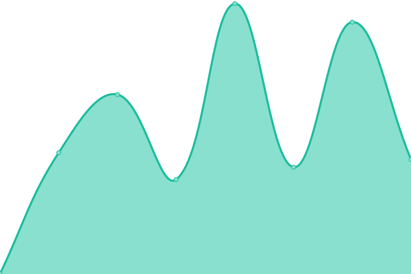

## 📈 Live Status: <!--live status--> **🟩 All systems operational**

<!--start: status pages-->
<!-- This summary is generated by Upptime (https://github.com/upptime/upptime) -->
<!-- Do not edit this manually, your changes will be overwritten -->
<!-- prettier-ignore -->
| URL | Status | History | Response Time | Uptime |
| --- | ------ | ------- | ------------- | ------ |
|  [Documentation](https://documentation.platformos.com) | 🟩 Up | [documentation.yml](https://github.com/pavelloz/instances-uptimez/commits/HEAD/history/documentation.yml) | 

 513ms
     
 | 

<a href="https://pavelloz.github.io/instances-uptimez/history/documentation">100.00%</a>
    

|  [Marketing page](https://www.platformos.com) | 🟩 Up | [marketing-page.yml](https://github.com/pavelloz/instances-uptimez/commits/HEAD/history/marketing-page.yml) | 

 776ms
     
 | 

<a href="https://pavelloz.github.io/instances-uptimez/history/marketing-page">100.00%</a>
    

|  [Examples](https://examples.platform-os.com) | 🟩 Up | [examples.yml](https://github.com/pavelloz/instances-uptimez/commits/HEAD/history/examples.yml) | 

 485ms
     
 | 

<a href="https://pavelloz.github.io/instances-uptimez/history/examples">100.00%</a>
    

|  [Template MVP](https://getmarketplace.co) | 🟩 Up | [template-mvp.yml](https://github.com/pavelloz/instances-uptimez/commits/HEAD/history/template-mvp.yml) | 

 988ms
     
 | 

<a href="https://pavelloz.github.io/instances-uptimez/history/template-mvp">100.00%</a>
    

|  [Community Site](https://community.platformos.com) | 🟩 Up | [community-site.yml](https://github.com/pavelloz/instances-uptimez/commits/HEAD/history/community-site.yml) | 

 2354ms
     
 | 

<a href="https://pavelloz.github.io/instances-uptimez/history/community-site">100.00%</a>
    

<!--end: status pages-->
